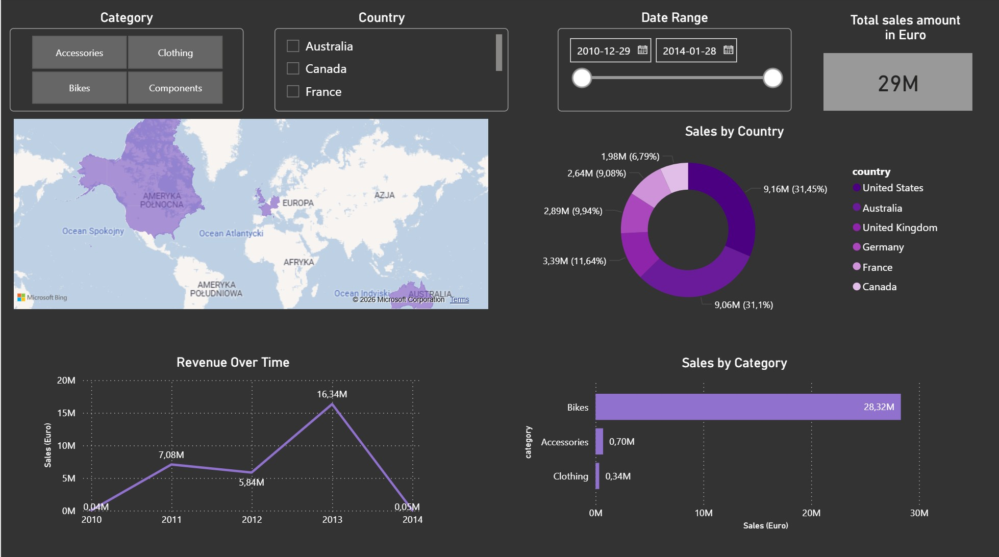

# AdventureWorks Cycles: Sales Intelligence Data Warehouse
### End-to-End SQL Server & Power BI Analytics Project

## Project Overview
This project involves the transition from raw transactional data to a structured Data Warehouse environment using the **AdventureWorks** dataset. Unlike previous e-commerce projects, this implementation focuses on the **SQL Server (T-SQL)** ecosystem, utilizing dimensional modeling to drive business insights.

The goal was to transform complex OLTP tables into a clean Star Schema, enabling an interactive deep-dive into global sales performance, product trends, and regional profitability.

---

## Data Architecture & Workflow
The technical process was divided into four distinct stages:
1.  **Data Extraction:** Ingesting raw tables from the AdventureWorks database.
2.  **T-SQL Transformation:** 
    *   Cleaning and standardizing customer and product metadata.
    *   Implementing a **Star Schema** (Fact and Dimension tables) for optimized query performance.
    *   Creating SQL Views to serve as a decoupled "Silver/Gold" layer for Power BI.
3.  **DAX Modeling:** Developing custom measures in Power BI to calculate growth, margins, and period-over-period trends.
4.  **Visualization:** Designing an Executive Dashboard with a focus on regional market shares and category performance.

---

## 🛠️ Tech Stack
*   **Database Engine:** Microsoft SQL Server
*   **Language:** T-SQL (Advanced Joins, Data Cleaning, Views)
*   **BI Tool:** Power BI (DAX, Data Modeling)
*   **Modeling:** Star Schema Architecture

---

## 📊 Dashboard Preview (Power BI)
**Global Sales & Product Performance Analysis**

  

### **Analytical Insights:**
*   **Global Revenue Hubs:** Total sales reached **€29M**, with the **United States (31.45%)** and **Australia (31.1%)** emerging as the dominant markets, together controlling over 62% of global revenue.
*   **Core Product Driver:** The **Bikes** category is the primary engine of the business, generating **€28.32M** — representing the vast majority of the total sales volume.
*   **Revenue Volatility:** The "Revenue Over Time" chart reveals a massive surge in **2013 (€16.34M)**, followed by a sharp drop-off in early 2014, signaling a critical need for investigation into market saturation or data cut-off points.
*   **Regional Efficiency:** Germany and the UK maintain steady market shares (approx. 9-11%), showing a stable but secondary European presence compared to the Pacific and North American markets.

### **Strategic Recommendations:**
*   **Cross-Selling Strategy:** With Bikes driving almost all revenue, there is an untapped opportunity to bundle high-margin **Accessories** and **Clothing** to increase the Average Order Value (AOV).
*   **Market Expansion:** Given the neck-and-neck performance of the US and Australia, localized inventory hubs in these regions could further optimize shipping costs and delivery times.
*   **Customer Retention:** Investigate the 2014 sales decline to determine if it relates to customer churn or product lifecycle issues, and implement loyalty programs for the core "Bikes" segment.

---

## How to Run
1.  **Database:** Ensure you have the `AdventureWorksDW` database restored on your SQL Server instance.
2.  **SQL Views:** Execute the scripts provided in the `/sql_scripts/` folder to prepare the reporting layer.
3.  **Power BI:** Open the `.pbix` file from the `/dashboard/` directory.
4.  **Connection:** Update the Data Source settings to link to your local SQL Server instance.
